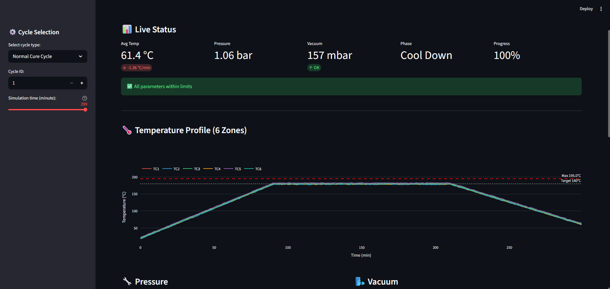

# Composite Autoclave Digital Twin Dashboard
 

 
## Overview
Real-time monitoring dashboard for CFRP composite autoclave
curing. Simulates 6-zone temperature, pressure, and vacuum
sensor data with anomaly detection.
 
Concept designed for Airbus Stade composite production.
 
## Live Demo
**[Open Dashboard](https://autoclave.streamlit.app/)**
 
## Features
- 6-zone temperature monitoring with limit bands
- Pressure and vacuum tracking with alarm thresholds
- Temperature zone heatmap
- ML anomaly detection (Isolation Forest)
- Cure cycle replay with time slider
- 4 anomaly scenarios: TC drift, pressure leak,
  heater failure, vacuum bag leak
 
## Anomaly Scenarios
| Scenario | What Happens | When |
|----------|-------------|------|
| TC Drift | TC3 reads high | After min 100 |
| Pressure Leak | Pressure drops | After min 60 |
| Heater Failure | TC2 drops 25C | After min 50 |
| Vacuum Leak | Vacuum > 300 mbar | After min 120 |
 
## Tech Stack (All Free)
- Python, Streamlit, Plotly
- Scikit-learn (Isolation Forest)
- Pandas, NumPy
 
## Relevance to Airbus
- Stade uses autoclaves for CFRP VTP and A350 parts
- CTC works on smart factory and process optimization
- Matches "Working Student Digitalization (AI, RPA)"
- Aligned with Airbus DDMS and Industry 4.0
 
## Author
**Oscar Vincent Dbritto**
M.Sc. Digitalization & Automation
[LinkedIn](https://linkedin.com/in/oscar-dbritto) |
[Portfolio](https://oscardbritto.framer.website)
